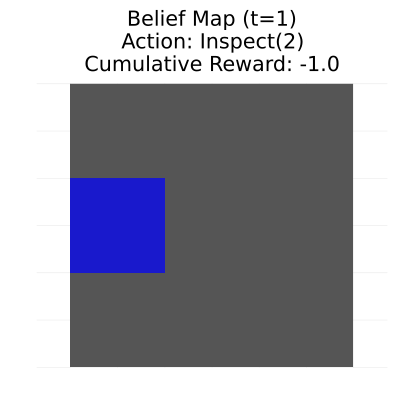
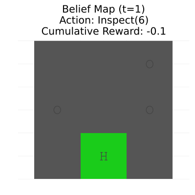

# UAV Landing Zone Search with POMDPs

This project implements a **Partially Observable Markov Decision Process (POMDP)** framework for actively locating a safe landing zone in a 3D environment using onboard camera observations.

## 🧠 Problem Overview

A UAV (e.g., drone) equipped with a limited field-of-view (FOV) camera must find a designated **landing zone** hidden among other cells that may be **empty** or contain **obstacles**. The challenge is compounded by:
- Occlusions,
- Uncertain observations,
- Large state and observation spaces.

## ✨ Key Features

- **OO-POMDP Formulation:** Object-oriented POMDP model for grid-based 3D search.
- **Volumetric Observations:** Camera FOV modeled as a frustum with voxel-based labeling (landing zone, obstacle, or empty).
- **Belief Representation:** Efficient octree-based belief updates for scalability.
- **Multi-Resolution Planning:** Uses MR-POUCT for abstraction-based planning across multiple resolutions.
- **Simulation Environment:** Discrete 3D grid world with move/look/find actions and occlusion-aware observations.

## 🗂️ Code Structure

| File | Description |
|------|-------------|
| `new.jl` | Core POMDP model and planner |
| `new_v3.jl` | Updated version with multi-resolution abstraction |
| `uav_pomdp.jl` | Main simulation loop |
| `uav_grid_inspector.jl` | Grid state generation and environment logic |
| `grid_world.jl` | Utility functions for 3D grid mapping |
| `belief_2D.gif`, `landing_belief_1.gif` | Visualization of belief updates |

## 🚀 How to Run

1. Install Julia (>= 1.8 recommended)
2. Install required packages:
    ```julia
    using Pkg
    Pkg.add(["POMDPs", "POMDPTools", "QuickPOMDPs", "POMCPOW", "Plots", "Random", "Combinatorics"])
    ```
3. Run simulation:
    ```bash
    julia uav_pomdp.jl
    ```

## 🎯 Goal

The UAV must:
- Efficiently explore the environment,
- Maintain and update a belief over possible landing zones,
- Choose when and where to declare the landing zone confidently.

## 📸 Visuals

Belief evolution examples:
- 
- 

## 📚 References

- Zheng et al., [Multi-Resolution POMDP Planning for Multi-Object Search in 3D](https://arxiv.org/abs/2005.02878)
- POMDPs.jl documentation: https://juliapomdp.github.io

## 📄 License

MIT License. See `LICENSE` file.
